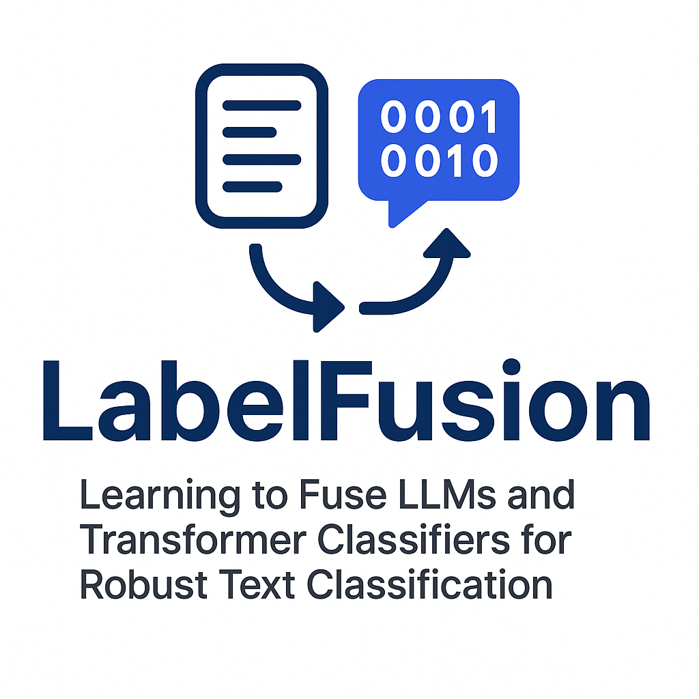

<p align="center">
  
</p>

# LabelFusion

**Learning to Fuse LLMs and Transformer Classifiers for Robust Text Classification**

A Python package for advanced text classification that combines Large Language Models (LLMs) with traditional transformer-based classifiers through a learned fusion approach. LabelFusion uses a trainable neural network to intelligently combine predictions from ML models (like RoBERTa) and LLMs (OpenAI, Gemini, DeepSeek) to achieve superior accuracy with data efficiency.

[](https://opensource.org/licenses/MIT)
[](https://www.python.org/downloads/)

## Key Innovation: AutoFusion

**The simplest way to get state-of-the-art text classification:**

```python
from textclassify.ensemble.auto_fusion import AutoFusionClassifier

# One configuration, automatic ML+LLM fusion!
config = {
    'llm_provider': 'deepseek',  # or 'openai', 'gemini'
    'label_columns': ['positive', 'negative', 'neutral']
}

classifier = AutoFusionClassifier(config)
classifier.fit(your_dataframe)  # Trains ML backbone + LLM + fusion layer
predictions = classifier.predict(test_texts)
```

**What makes it special?**
- **Superior Performance**: 92.4% accuracy on AG News, 92.3% on Reuters-21578 (vs individual models)
- **Data Efficient**: Achieves 92.2% with only 20% training data
- **Learned Fusion**: Neural network learns optimal combination of ML embeddings + LLM scores
- **Cost-Aware**: Intelligent caching and efficient resource usage
- **One-Line Setup**: No complex configuration needed

## Features

## Features

### Fusion Ensemble (Core Innovation)
- **AutoFusionClassifier**: One-line interface for ML+LLM fusion
- **FusionMLP**: Trainable neural network that combines predictions
- **Smart Training**: Different learning rates for ML backbone vs fusion layer
- **Calibration**: Temperature scaling and isotonic regression for better probability estimates
- **Production-Ready**: Includes caching, results management, and cost monitoring

### Supported Models
- **LLM Providers**: OpenAI GPT, Google Gemini, DeepSeek
- **ML Models**: RoBERTa-based classifiers with fine-tuning
- **Traditional Ensembles**: Voting, weighted, and class-specific routing

### Classification Support
- **Multi-class**: Single label per text (mutually exclusive)
- **Multi-label**: Multiple labels per text (28 emotions on GoEmotions dataset)

### Production Features
- **LLM Response Caching**: Automatic disk-based caching to reduce API costs
- **Results Management**: Track experiments, metrics, and predictions
- **Batch Processing**: Efficient processing of large datasets
- **Async Support**: Asynchronous LLM API calls for better throughput

## Performance Benchmarks

### AG News Topic Classification (4-class)

Evaluated on AG News dataset with 5,000 test samples:

| Training Data | Model | Accuracy | F1-Score | Precision | Recall |
|--------------|-------|----------|----------|-----------|--------|
| 20% (800) | **Fusion** | **92.2%** | **0.922** | 0.923 | 0.922 |
| 20% (800) | RoBERTa | 89.8% | 0.899 | 0.902 | 0.898 |
| 20% (800) | OpenAI | 85.1% | 0.847 | 0.863 | 0.846 |
| 40% (1,600) | **Fusion** | **92.2%** | **0.922** | 0.924 | 0.922 |
| 40% (1,600) | RoBERTa | 91.0% | 0.911 | 0.913 | 0.910 |
| 40% (1,600) | OpenAI | 83.9% | 0.835 | 0.847 | 0.834 |
| 100% (4,000) | **Fusion** | **92.4%** | **0.924** | 0.926 | 0.924 |
| 100% (4,000) | RoBERTa | 92.2% | 0.922 | 0.923 | 0.922 |
| 100% (4,000) | OpenAI | 85.3% | 0.849 | 0.868 | 0.847 |

### Reuters-21578 Topic Classification (10-class)

Evaluated on Reuters-21578 single-label 10-class subset:

| Training Data | Model | Accuracy | F1-Score | Precision | Recall |
|--------------|-------|----------|----------|-----------|--------|
| 20% (1,168) | **Fusion** | **72.0%** | **0.752** | 0.769 | 0.745 |
| 20% (1,168) | RoBERTa | 67.3% | 0.534 | 0.465 | 0.643 |
| 20% (1,168) | OpenAI | 88.6% | 0.928 | 0.951 | 0.923 |
| 40% (2,336) | **Fusion** | **83.6%** | **0.886** | 0.893 | 0.889 |
| 40% (2,336) | RoBERTa | 82.0% | 0.836 | 0.858 | 0.850 |
| 40% (2,336) | OpenAI | 87.9% | 0.931 | 0.952 | 0.917 |
| 100% (5,842) | **Fusion** | **92.3%** | **0.960** | 0.967 | 0.961 |
| 100% (5,842) | RoBERTa | 89.0% | 0.946 | 0.932 | 0.966 |
| 100% (5,842) | OpenAI | 88.9% | 0.939 | 0.963 | 0.927 |

**Key Findings:**
- Fusion consistently outperforms individual models across both datasets
- Superior data efficiency: achieves 92.2% on AG News with only 20% training data
- Combines LLM reasoning with ML efficiency for robust classification
- Demonstrates strong performance on both balanced (AG News) and imbalanced (Reuters) datasets

## Installation

```bash
# Install from source
git clone https://github.com/DataandAIReseach/LabelFusion.git
cd LabelFusion
pip install -e .
```

### Dependencies

**Core Requirements:**
```bash
pip install pandas python-dotenv openai aiohttp google-generativeai
```

**For ML Models (RoBERTa):**
```bash
pip install transformers torch scikit-learn
```

**For Development:**
```bash
pip install -e ".[dev]"
```

## Quick Start

### 1. AutoFusion - Simplest Way (Recommended)

```python
from textclassify.ensemble.auto_fusion import AutoFusionClassifier
import pandas as pd

# Your training data
df = pd.DataFrame({
    'text': [
        "I love this product!",
        "Terrible experience, very disappointed",
        "It's okay, nothing special"
    ],
    'positive': [1, 0, 0],
    'negative': [0, 1, 0],
    'neutral': [0, 0, 1]
})

# Simple configuration
config = {
    'llm_provider': 'deepseek',  # Choose: 'deepseek', 'openai', or 'gemini'
    'label_columns': ['positive', 'negative', 'neutral']
}

# Train fusion model (ML + LLM + learned combination)
classifier = AutoFusionClassifier(config)
classifier.fit(df)

# Make predictions
test_texts = ["This is amazing!", "Not good at all"]
result = classifier.predict(test_texts)
print(result.predictions)  # ['positive', 'negative']
```

### 2. Multi-Label Classification

```python
# Multi-label example (e.g., movie genres)
config = {
    'llm_provider': 'deepseek',
    'label_columns': ['action', 'comedy', 'drama', 'horror', 'romance'],
    'multi_label': True  # Enable multi-label mode
}

classifier = AutoFusionClassifier(config)
classifier.fit(movie_dataframe)

result = classifier.predict(["A funny action movie with romance"])
print(result.predictions[0])  # ['action', 'comedy', 'romance']
```

### 3. Using Individual LLM Classifiers

```python
from textclassify import DeepSeekClassifier, OpenAIClassifier, GeminiClassifier
from textclassify.config import Config

# Configure LLM
config = Config()
config.model_type = ModelType.LLM
config.parameters = {
    'model': 'deepseek-chat',
    'temperature': 1,
    'max_tokens': 150
}

# Create classifier
classifier = DeepSeekClassifier(
    config=config,
    text_column='text',
    label_columns=['positive', 'negative', 'neutral']
)

# Make predictions
result = classifier.predict(train_df=train_df, test_df=test_df)
```

### 4. RoBERTa Classifier (Traditional ML)

```python
from textclassify.ml import RoBERTaClassifier
from textclassify.core.types import ModelConfig, ModelType

config = ModelConfig(
    model_name='roberta-base',
    model_type=ModelType.TRADITIONAL_ML,
    parameters={
        'max_length': 256,
        'learning_rate': 2e-5,
        'num_epochs': 3,
        'batch_size': 16
    }
)

classifier = RoBERTaClassifier(
    config=config,
    text_column='text',
    label_columns=['positive', 'negative', 'neutral'],
    multi_label=False
)

classifier.fit(train_df)
result = classifier.predict(test_texts)
```

## Advanced Fusion Usage

### Manual Fusion Configuration

For advanced users who want full control:

```python
from textclassify.ensemble.fusion import FusionEnsemble
from textclassify.ml.roberta_classifier import RoBERTaClassifier
from textclassify.llm.deepseek_classifier import DeepSeekClassifier

# Create ML model
ml_config = ModelConfig(
    model_name='roberta-base',
    model_type=ModelType.TRADITIONAL_ML
)
ml_model = RoBERTaClassifier(config=ml_config, label_columns=labels)

# Create LLM model
llm_config = Config()
llm_model = DeepSeekClassifier(config=llm_config, label_columns=labels)

# Create fusion ensemble
fusion = FusionEnsemble(
    ml_classifier=ml_model,
    llm_classifiers=[llm_model],
    label_columns=labels,
    classification_type=ClassificationType.MULTI_CLASS
)

# Train fusion layer
fusion.fit(
    train_texts=train_df['text'].tolist(),
    train_labels=train_df[labels].values.tolist(),
    val_texts=val_df['text'].tolist(),
    val_labels=val_df[labels].values.tolist()
)

# Predict
result = fusion.predict(test_texts, test_labels)
```

### Command-Line Training

```bash
# Create config file
python train_fusion.py --create-config fusion_config.yaml

# Edit fusion_config.yaml with your settings, then train
python train_fusion.py --config fusion_config.yaml

# Evaluate on test data
python train_fusion.py --config fusion_config.yaml --evaluate --test-data path/to/test.csv
```

## Traditional Ensemble Methods

### Voting Ensemble

```python
from textclassify import VotingEnsemble, EnsembleConfig
from textclassify import OpenAIClassifier, GeminiClassifier

## Traditional Ensemble Methods

### Voting Ensemble

```python
from textclassify import VotingEnsemble, EnsembleConfig
from textclassify import OpenAIClassifier, GeminiClassifier

# Create individual classifiers
openai_clf = OpenAIClassifier(openai_config)
gemini_clf = GeminiClassifier(gemini_config)

ensemble = VotingEnsemble(ensemble_config)
ensemble.add_model(openai_clf, "openai")
ensemble.add_model(gemini_clf, "gemini")

ensemble.fit(training_data)
result = ensemble.predict(texts)
# Supports: 'majority', 'plurality' voting strategies
```

### Weighted Ensemble

```python
from textclassify import WeightedEnsemble

ensemble_config = EnsembleConfig(
    models=[model1_config, model2_config],
    ensemble_method="weighted",
    weights=[0.7, 0.3]  # Custom weights based on validation performance
)
ensemble = WeightedEnsemble(ensemble_config)
```

### Class Routing Ensemble

```python
from textclassify import ClassRoutingEnsemble

routing_rules = {
    "technical": "model1",
    "creative": "model2"
}

ensemble_config = EnsembleConfig(
    models=[model1_config, model2_config],
    ensemble_method="routing",
    routing_rules=routing_rules
)
ensemble = ClassRoutingEnsemble(ensemble_config)
```

## Supported Models

### LLM Providers

| Provider | Models | API Key Required |
|----------|--------|------------------|
| OpenAI | gpt-3.5-turbo, gpt-4, gpt-4-turbo | ✅ |
| Gemini | gemini-1.5-flash, gemini-1.5-pro | ✅ |
| DeepSeek | deepseek-chat, deepseek-coder | ✅ |

### ML Models

| Model | Description | Dependencies |
|-------|-------------|--------------|
| RoBERTa | Fine-tunable transformer model | transformers, torch, scikit-learn |

## Production Features

### LLM Response Caching

```python
# Caching is automatic! Reduces API costs dramatically
classifier = DeepSeekClassifier(
    config=config,
    auto_use_cache=True,  # Enable automatic cache usage
    cache_dir="cache"      # Cache directory
)
```

### Results Management

```python
# Automatic experiment tracking
classifier = AutoFusionClassifier(
    config,
    output_dir="outputs",
    experiment_name="my_experiment",
    auto_save_results=True  # Saves predictions, metrics, and config
)
```

## API Reference

### Core Classes

- `AutoFusionClassifier` - One-line ML+LLM fusion interface (⭐ recommended)
- `FusionEnsemble` - Advanced fusion ensemble with manual control
- `FusionMLP` - Trainable neural network for fusion
- `BaseClassifier` - Abstract base class for all classifiers
- `ClassificationResult` - Container for prediction results
- `ModelConfig` - Configuration for individual models
- `EnsembleConfig` - Configuration for ensemble methods

### LLM Classifiers

- `OpenAIClassifier` - OpenAI GPT models
- `GeminiClassifier` - Google Gemini models
- `DeepSeekClassifier` - DeepSeek models

### ML Classifiers

- `RoBERTaClassifier` - RoBERTa-based classifier with fine-tuning

### Traditional Ensemble Methods

- `VotingEnsemble` - Voting-based ensemble
- `WeightedEnsemble` - Weighted ensemble  
- `ClassRoutingEnsemble` - Class-specific routing

## Configuration Management

### API Key Management

```python
from textclassify.config import APIKeyManager

# Set up API keys
api_manager = APIKeyManager()
api_manager.set_key("openai", "your-openai-key")
api_manager.set_key("gemini", "your-gemini-key")

# Or use environment variables (recommended)
# export OPENAI_API_KEY="your-key"
# export GEMINI_API_KEY="your-key"
# export DEEPSEEK_API_KEY="your-key"
```

### Configuration Files

```python
from textclassify.config import Config

# Load configuration
config = Config()
config.load('config.yaml')

# Or create from scratch
config.set('llm.default_provider', 'deepseek')
config.set('general.batch_size', 32)
config.save('my_config.yaml')
```

## Evaluation and Metrics

```python
from textclassify.utils import evaluate_predictions

# Evaluate model performance
result = classifier.predict(test_texts, test_labels)

if result.metadata and 'metrics' in result.metadata:
    metrics = result.metadata['metrics']
    print(f"Accuracy: {metrics['accuracy']:.3f}")
    print(f"F1 Score: {metrics['f1']:.3f}")
    print(f"Precision: {metrics['precision']:.3f}")
    print(f"Recall: {metrics['recall']:.3f}")
```

## Examples and Documentation

### Example Scripts

The package includes comprehensive examples in the `examples/` and `textclassify/examples/` directories:

- `test_autofusion_kaggle.py` - AutoFusion on real dataset
- `test_kaggle_data.py` - Testing with Kaggle ecommerce data
- `multi_class_example.py` - Multi-class classification examples
- `multi_label_example.py` - Multi-label classification examples
- `ensemble_example.py` - Advanced ensemble methods

### Evaluation Scripts

Comprehensive evaluation scripts in `tests/evaluation/`:

- `eval_ag_news.py` - AG News topic classification benchmarks
- `eval_goemotions.py` - GoEmotions multi-label emotion classification

### Documentation Files

- `FUSION_README.md` - Detailed fusion ensemble documentation
- `PACKAGE_OVERVIEW.md` - Complete package architecture overview
- `AUTO_CACHE_FEATURE.md` - LLM caching system documentation
- `paper_labelfusion.md` - Academic paper describing the fusion methodology

## How It Works

### Fusion Architecture

1. **ML Backbone** (RoBERTa): Generates logits from input text
2. **LLM Component**: Produces per-class scores via prompting (cached for efficiency)
3. **Calibration**: Both ML and LLM signals are calibrated for better probability estimates
4. **FusionMLP**: Small neural network concatenates and learns to combine the signals
5. **Training**: ML backbone uses small learning rate, fusion MLP uses higher rate for fast adaptation

### Why Fusion Works

- **Complementary Strengths**: LLMs provide robust reasoning, ML provides efficiency
- **Data Efficiency**: LLM knowledge compensates for limited training data
- **Learned Combination**: Neural network optimizes the fusion for your specific task
- **Cost-Effective**: Caching and smart fusion reduce LLM API costs

## Use Cases

- **Customer Feedback Analysis**: Multi-label sentiment with nuanced categories
- **Content Moderation**: Balance accuracy with real-time processing requirements
- **Scientific Literature Classification**: Handle domain shift and new terminology
- **Low-Resource Scenarios**: Achieve high accuracy with limited training data
- **Multi-Domain Classification**: Leverage complementary model strengths

## Contributing

We welcome contributions! Please see our development setup below.

### Development Setup

```bash
git clone https://github.com/DataandAIReseach/LabelFusion.git
cd LabelFusion
pip install -e ".[dev]"
```

### Running Tests

```bash
# Unit tests
pytest tests/

# Integration tests
pytest tests/integration/

# Evaluation benchmarks
python tests/evaluation/eval_ag_news.py
python tests/evaluation/eval_goemotions.py
```

## Citation

If you use LabelFusion in your research, please cite:

```bibtex
@software{labelfusion2025,
  title={LabelFusion: Learning to Fuse LLMs and Transformer Classifiers for Robust Text Classification},
  author={Weisser, Christoph and Contributors},
  year={2025},
  url={https://github.com/DataandAIReseach/LabelFusion}
}
```

See `paper_labelfusion.md` for the full research paper.

## License

This project is licensed under the MIT License - see the [LICENSE](LICENSE) file for details.

## Support and Links

- 📖 **Documentation**: See `FUSION_README.md` and `PACKAGE_OVERVIEW.md`
- 🐛 **Issues**: [GitHub Issues](https://github.com/DataandAIReseach/LabelFusion/issues)
- � **Paper**: [paper_labelfusion.md](paper_labelfusion.md)
- **Examples**: Check `examples/` and `textclassify/examples/` directories

## Changelog

See [CHANGELOG.md](CHANGELOG.md) for version history and updates.

---

<p align="center">
  <strong>LabelFusion</strong> - Superior text classification through learned ML+LLM fusion
</p>

